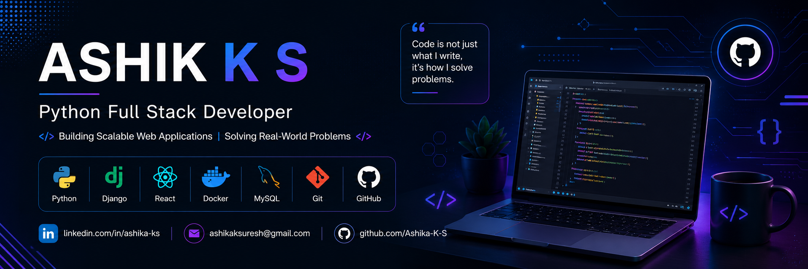

  

<h1 align="center">Hi 👋, I'm Ashik K S</h1>

<h3 align="center">A passionate Python Full Stack Developer from India</h3>

* 🔭 I’m currently working on **FocusArena**

* 🌱 I’m currently learning **Docker, DevOps & System Design**

* 👨‍💻 All of my projects are available at
  https://github.com/Ashika-K-S

* 💬 Ask me about **Python, Django, DRF, React & PostgreSQL**

* 📫 How to reach me
  **[ashikaksuresh@gmail.com](mailto:ashikaksuresh@gmail.com)**

  

<h2 align="left">Languages and Tools:</h2>

<h2 align="left">Connect with me:</h2>

